# DiaBeates System Architecture

## Overview
DiaBeates is a production-hardened, web-based clinical decision support system for diabetes complication triage. It combines evidence-based clinical guideline scoring with calibrated machine learning estimators across four microvascular and macrovascular complication domains. The architecture follows a modular, layered design with strict separation of concerns, containerized deployment, and robust security controls.

## Architecture Diagram

```mermaid
graph TB
    subgraph Frontend["🖥️ Frontend Layer"]
        Home["home.html<br/>(Landing Page)"]
        Assessment["assessment.html<br/>(15 Indicators + BMI Modal)"]
        Result["result.html<br/>(4 Risk Tiers + Patient Risk Drivers)"]
        History["history.html<br/>(Sortable History + Archive/Delete)"]
        PrintResult["print_result.html<br/>(Printable Chart Summary)"]
        About["about.html<br/>(Documentation)"]
    end

    subgraph Deployment["🚀 Deployment & Server Runtime"]
        Docker["Docker Container<br/>(Dockerfile / Compose)"]
        WSGI["Waitress WSGI Server<br/>(wsgi.py - 8 Threads)"]
        Health["/health Endpoint<br/>(Liveness & Readiness Probe)"]
    end

    subgraph WebServer["🌐 Web Application Layer"]
        Flask["Flask Application<br/>(app.py)"]
        SecurityHeaders["Security Headers & CSRF<br/>(Flask-WTF / Headers)"]
        RateLimiter["Rate Limiting<br/>(Flask-Limiter)"]
    end

    subgraph BusinessLogic["🧠 Business Logic Layer"]
        Rules["Rule Matrix Engine<br/>(rule_matrix.py: 4 Domains)"]
        Recommendations["Recommendations & Drivers<br/>(recommendations.py)"]
        Validation["Server Validation<br/>(validation.py)"]
        FieldLabels["Field Translations<br/>(field_labels.py)"]
    end

    subgraph MLLayer["🤖 Machine Learning Layer"]
        TrainModel["Model Training & CV<br/>(train_model.py)"]
        Wrapper["ClinicalRiskWrapper<br/>(clinical_model.py)"]
        ModelCache["Serialized Calibrated Models<br/>(model/*.pkl: 4 Estimators)"]
        Summary["Training Summary & CIs<br/>(training_summary.json)"]
    end

    subgraph DataLayer["💾 Data Persistence Layer"]
        Database["SQLite with WAL Mode<br/>(database.py)"]
        DBAssessments["📊 assessments table"]
        DBResults["📊 risk_results table"]
        DBLabs["📊 lab_assessments table"]
        DBFeedback["📊 feedback table"]
        Retention["Data Pruning Policy<br/>(prune_expired_assessments)"]
    end

    subgraph DataSources["📁 Authentic Clinical Cohorts"]
        CVDData["CDC NHANES 2017-2018<br/>(CVD Cohort N=949)"]
        CKDData["CDC NHANES 2021-2023<br/>(KDIGO CKD Cohort N=848)"]
        BRFSSData["CDC BRFSS Registry<br/>(Neuropathy Cohort N=5,000)"]
        RetinoData["CDC NHANES Retinopathy<br/>(Retina Exam Cohort N=797)"]
    end

    %% Deployment connections
    Docker --> WSGI
    WSGI --> Flask
    Flask --> Health

    %% Frontend to Web Application
    Home --> Flask
    Assessment --> Flask
    Result --> Flask
    History --> Flask
    PrintResult --> Flask
    About --> Flask

    %% Flask middleware & business logic
    Flask --> SecurityHeaders
    Flask --> RateLimiter
    Flask --> Validation
    Flask --> Rules
    Flask --> Recommendations
    Flask --> FieldLabels

    %% Flask to ML Layer
    Flask --> ModelCache
    ModelCache --> Wrapper

    %% Flask to Data Layer
    Flask --> Database
    Database --> DBAssessments
    Database --> DBResults
    Database --> DBLabs
    Database --> DBFeedback
    Database --> Retention

    %% Training pipeline
    CVDData --> TrainModel
    CKDData --> TrainModel
    BRFSSData --> TrainModel
    RetinoData --> TrainModel
    TrainModel --> ModelCache
    TrainModel --> Summary

    style Frontend fill:#e1f5fe
    style Deployment fill:#e0f2fe
    style WebServer fill:#fff3e0
    style BusinessLogic fill:#f3e5f5
    style MLLayer fill:#e8f5e9
    style DataLayer fill:#fce4ec
    style DataSources fill:#ede7f6
```



## Component Description

### 1. **Frontend Layer** (Templates & Modals)
- **home.html** - Landing page with system overview, complication cards, and clinical CTA pathways.
- **assessment.html** - Patient input form featuring 15 non-invasive clinical indicators, optional point-of-care laboratory biomarkers, and an accessible, interactive BMI calculator modal with unit conversion.
- **result.html** - Comprehensive 4-domain risk presentation combining clinical guideline tiers with calibrated empirical ML probabilities, alongside patient-specific risk driver explanations.
- **history.html** - Longitudinal patient assessment history supporting sortable chronological order (newest/oldest), stable sequential record numbering (`#1`, `#2`, ...), localized Philippine Standard Time (PHT / UTC+8) timestamps, soft archiving, and accessible deletion confirmation modals.
- **print_result.html** - Dedicated print-optimized PDF summary formatted specifically for clinical charts with coded factor translations and medical disclaimers.
- **about.html** - Clinical methodology, cohort provenance, algorithmic architecture, and ethical scope.
- **base.html** - Base layout providing WCAG-compliant navigation, semantic landmark regions, accessible skip links, and alert banners.

### 2. **Deployment & Web Server Layer**
- **Dockerfile & docker-compose.yml**
  - Production containerization running on `python:3.11-slim` under an unprivileged `appuser`.
  - Built-in Docker health check targeting `/health`.
  - Persistent volume mounts for SQLite database and rotating log files.
- **wsgi.py**
  - Multi-threaded production WSGI entrypoint powered by Waitress (`threads=8`, configurable host/port).
- **app.py**
  - Main Flask application with route handlers: `/`, `/assessment`, `/predict`, `/history`, `/history/<id>/print`, `/history/<id>/archive`, `/history/<id>/delete`, `/about`, and `/health`.
  - Enforces Flask-WTF CSRF protection across all modifying endpoints.
  - Applies strict HTTP security headers (`X-Frame-Options: DENY`, `X-Content-Type-Options: nosniff`, `Referrer-Policy`, `Permissions-Policy`, and `Strict-Transport-Security` in production).
  - Enforces IP-based rate limiting via Flask-Limiter (`300 per day`, `100 per hour`).
  - Implements operational `/health` probe verifying database connectivity and model status.

### 3. **Business Logic Layer**
- **rule_matrix.py (Version 2.0-clinical)**
  - Four evidence-based guideline scoring engines:
    1. **Cardiovascular**: ACC/AHA 10-Yr ASCVD & UKPDS risk factor scoring.
    2. **Nephropathy**: KDIGO 2024 Chronic Kidney Disease risk staging.
    3. **Neuropathy**: Michigan Neuropathy Screening Instrument (MNSI) functional mobility mapping.
    4. **Retinopathy**: American Diabetes Association (ADA) and American Academy of Ophthalmology (AAO) screening criteria.
  - Converts risk factors to clinical risk tiers: Low ($\le 30\%$), Moderate ($31\% - 60\%$), High ($> 60\%$).
  - Serves exclusively as an interpretable baseline and explanation layer (never used to generate training labels).
- **recommendations.py**
  - Generates personalized lifestyle, surveillance, and specialist referral recommendations.
  - Computes patient-specific risk drivers to explain the exact clinical factors contributing to elevated risk.
- **validation.py**
  - Server-side bounds checking for all 15 clinical indicators and optional laboratory values.
  - Guarantees data integrity prior to rule execution, inference, or persistence.
- **field_labels.py**
  - Human-readable descriptions, units, and categorized labels for patient indicators.

### 4. **Machine Learning Layer**
- **clinical_data_pipeline.py**
  - Ingests authentic epidemiological data from CDC NHANES (CVD, CKD, Retinopathy) and CDC BRFSS.
  - Preprocesses clinical features and encodes gold-standard empirical diagnostic endpoints.
- **train_model.py**
  - Trains calibrated machine learning models using 5-fold Stratified Cross-Validation strictly within training partitions.
  - Evaluates candidate models (Calibrated Logistic Regression, Calibrated Random Forest, Gradient Boosting).
  - Derives leak-free operating thresholds using Youden's J statistic targeting high sensitivity (>86%) and NPV (>79%–96%).
  - Computes 95% bootstrap confidence intervals (1,000 resamples) for all discrimination and calibration metrics.
- **clinical_model.py**
  - Encapsulates winning estimators in `ClinicalRiskWrapper` to guarantee deterministic, environment-agnostic joblib serialization.
- **model/ Directory**
  - `cardiovascular_model.pkl`: Calibrated ASCVD risk estimator.
  - `general_burden_model.pkl`: Calibrated KDIGO CKD risk estimator.
  - `neuropathy_mobility_model.pkl`: Calibrated MNSI mobility risk estimator.
  - `retinopathy_model.pkl`: Calibrated Retinopathy risk estimator.
  - `training_summary.json`: Detailed epidemiological validation metrics, thresholds, and bootstrap CIs.
  - `clinical_roc_curves.png` & `clinical_calibration_curves.png`: Diagnostic discrimination and calibration plots.

### 5. **Data Persistence Layer** (SQLite with WAL Mode)
- **database.py** - Database abstraction layer featuring non-destructive schema migrations and Write-Ahead Logging.
  - `assessments` - Raw clinical indicators, diabetes duration, blurry vision, session ID, archive flag, and UTC timestamp.
  - `risk_results` - Rule-based scores, guideline labels, calibrated ML event probabilities, and AUROC metrics across all 4 domains.
  - `lab_assessments` - Optional laboratory biomarkers (HbA1c, Systolic BP, LDL).
  - `feedback` - User feedback for continuous quality monitoring.
  - `prune_expired_assessments()` - Automated data retention policy pruning assessments older than 90 days.

### 6. **Authentic Clinical Data Sources**
- `nhanes_2017_2018_heart_disease_prediction.csv` - CDC NHANES 2017–2018 CVD diabetic cohort ($N=949$).
- `CKD_NHANES_2021_2023.csv` - CDC NHANES 2021–2023 nephropathy cohort with laboratory eGFR/uACR ($N=848$).
- `diabetes_dataset.csv` - CDC BRFSS diabetic registry ($N=35,346$ population, $N=5,000$ stratified sample).
- `processed_retinopathy_cohort.csv` - CDC NHANES Retinopathy Exam cohort with digital retinal imaging ($N=797$).

---

## Data Flow Pipelines

### 1. Assessment Submission Flow
```
Patient Form Submission (assessment.html)
    ↓
Flask Route Handler (/predict in app.py)
    ↓
CSRF & Rate Limit Verification (Flask-WTF + Flask-Limiter)
    ↓
Server-Side Input Validation (validation.py)
    ↓
Guideline Rule Matrix Scoring (rule_matrix.py: 4 Domains)
    ↓
Calibrated ML Model Inference (model/*.pkl via ClinicalRiskWrapper)
    ↓
Patient-Specific Risk Drivers & Recommendations (recommendations.py)
    ↓
Database Persistence (database.py → SQLite WAL)
    ↓
Presentation Rendering (result.html / print_result.html)
```

### 2. Clinical Training & Evaluation Flow
```
Epidemiological Cohorts (CDC NHANES CVD, CKD, Retinopathy & BRFSS)
    ↓
clinical_data_pipeline.py (Cohort Extraction & Ground Truth Encoding)
    ↓
Stratified 80/20 Train/Test Partitioning
    ↓
5-Fold Stratified Cross-Validation on Training Folds Only
    ↓
Model Comparison (Calibrated Logistic Regression vs Random Forest vs Gradient Boosting)
    ↓
Platt / Isotonic Calibration (CalibratedClassifierCV)
    ↓
Leak-Free Threshold Selection on Training Folds via Youden's J
    ↓
Holdout Test Evaluation with 95% Bootstrap Confidence Intervals (1,000 Resamples)
    ↓
Serialization via ClinicalRiskWrapper into model/*.pkl
```

---

## Technology Stack

- **Server Runtime**: Python 3.11, Waitress WSGI, Docker, Docker Compose
- **Web Framework**: Flask 3.0+, Flask-WTF (CSRF), Flask-Limiter, python-dotenv
- **Machine Learning**: scikit-learn 1.4+, joblib, pandas, numpy, matplotlib
- **Database**: SQLite3 (Write-Ahead Logging mode)
- **Frontend**: HTML5, Tailwind CSS, Vanilla JavaScript (WCAG 2.1 AA compliant)

