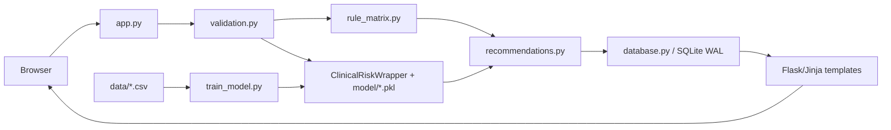

# Architecture

The web request path is separate from offline training. The rule matrix never generates the labels used by model training.

## Request Flow

`POST /predict` passes through CSRF and rate limiting, server-side validation, four rule scores, model inference, risk-driver/recommendation generation, SQLite persistence, and result rendering. History and print routes only return records belonging to the current anonymous session.

## Components

- `app.py`: Flask lifecycle, routes, anonymous session UUID, model loading, logging, retention, CSRF, rate limiting, and response headers.
- `wsgi.py`: Waitress on `127.0.0.1` only, eight threads, `PORT` default 5000.
- `clinical_model.py`: selects each model's feature subset and maps probabilities to lower/moderate/higher estimated risk.
- `rule_matrix.py`, `recommendations.py`, `field_labels.py`: rule scores, guidance, and display values.
- `templates/`: home, assessment, result, history, print, about, and base views.

## Routes

| Method | Path | Purpose |
|---|---|---|
| GET | `/` | Home |
| GET | `/assessment` | Assessment form |
| POST | `/predict` | Process an assessment (in-memory or optional DB save) |
| GET | `/report` | Standalone client-side report viewer shell |
| GET | `/about` | Method, clinical scope, and privacy notice |
| GET | `/health` | Database/model readiness; rate-limit exempt |
| GET | `/history` | Current session history |
| POST | `/history/export` | Export current session assessment records as JSON |
| POST | `/history/clear` | Purge all assessments for current session |
| GET | `/history/<id>` | Current session result |
| GET | `/history/<id>/print` | Printable result |
| POST | `/history/<id>/archive` | Soft archive |
| POST | `/history/<id>/delete` | Permanent delete |
| POST | `/feedback/<id>` | Store helpfulness feedback |
| GET | `/data/backup` | Self-verifying encrypted database backup bundle |
| POST | `/data/restore` | Restore database backup bundle with checksum verification |
| GET | `/diagnostics/export` | Sanitized technical metadata zip |

All modifying routes use global CSRF protection.

## Storage & Privacy Hardening

Assessments are processed by the local Python Flask runtime on the user's computer. When the user leaves "Save assessment to local history" unchecked, assessments remain strictly in-memory during request processing and generate self-contained report tokens without touching disk.

When opted in, SQLCipher 3 encrypts the database using AES-256 in WAL mode with foreign keys enabled. Schema version 4 contains `assessments`, `risk_results`, `lab_assessments`, and `feedback`. Startup pruning removes records older than `RETENTION_DAYS` (default 90). The database layer strictly scopes all user-facing queries, exports, and deletions by `session_id`. Windows local keys use user-scoped DPAPI (`.db.key.dpapi`); managed deployments may provide `DIABEATES_DB_KEY`.

## Model Loading

The app reads `model/training_summary.json` and attempts to load `cardiovascular_model.pkl`, `general_burden_model.pkl`, `neuropathy_mobility_model.pkl`, and `retinopathy_model.pkl`. Missing or unreadable files are logged; `/health` remains degraded until all four load.

## Deployment

The Dockerfile is a single-stage `python:3.11-slim` image running as `appuser`. Compose publishes port 5000 and mounts `./logs` and `./diabetes_system.db`; it sets only `DEBUG=False` and `PORT=5000`. For the local Windows pilot, use [DEPLOYMENT_HARDENING.md](DEPLOYMENT_HARDENING.md) and verify the packaged SQLCipher native library before distribution.
