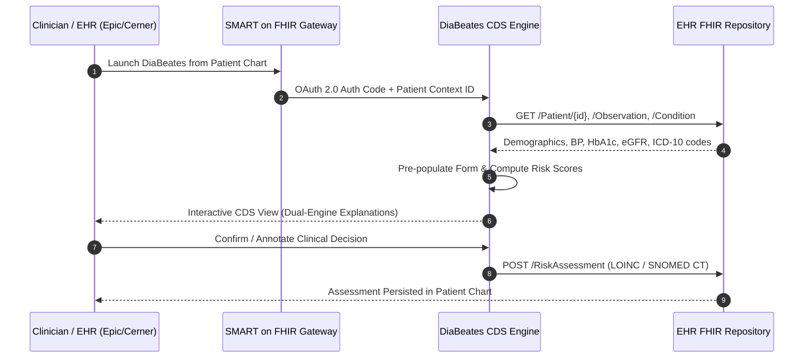
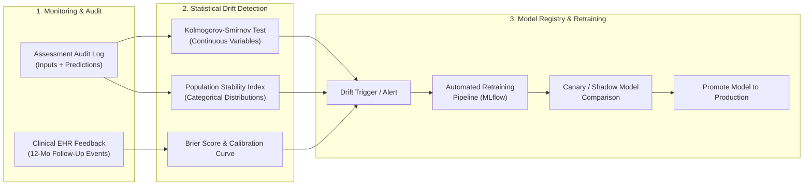
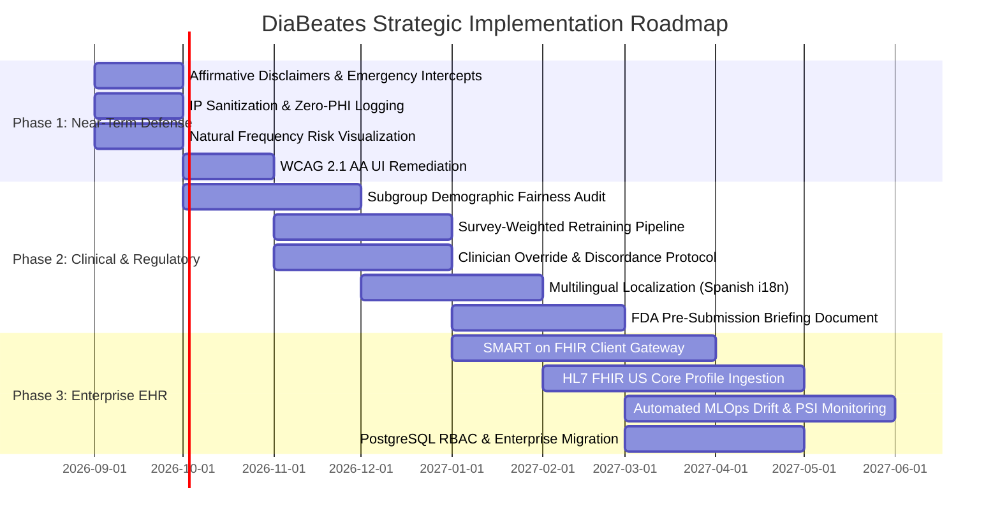

# 🏥 DiaBeates System: Strategic, Regulatory, Clinical & Ethical Analysis
## Task 4: Additional Critical Factors Analysis & Future-State Roadmap

**Document Version:** 1.0  
**Status:** Complete & Actionable  
**Date:** September 2026  
**Target Systems:** DiaBeates Complication Prediction Platform (Dual-Engine: Clinical Rules 2.0 & Calibrated NHANES ML Models)

---

## Executive Summary

The **DiaBeates** system represents an innovative dual-engine clinical risk prediction tool designed to stratify diabetic complications across three critical domains: **Cardiovascular Complications**, **Nephropathy & Renal Staging**, and **Neuropathy/Mobility Impairment**. By marrying deterministic, guideline-grounded clinical rule matrices (ACC/AHA, KDIGO 2024, MNSI) with calibrated machine learning estimators trained on authentic CDC NHANES cohorts, the system bridges the gap between clinical transparency and empirical risk projection.

However, transitioning any clinical algorithmic tool from an academic or prototype environment to real-world healthcare deployment requires navigating complex intersections of **medico-legal liability**, **statutory medical device regulations (FDA/EU MDR)**, **algorithmic fairness across diverse populations**, **EHR workflow integration (HL7 FHIR)**, **data privacy (HIPAA/GDPR)**, **continuous model governance (MLOps)**, **clinician agency (HITL)**, and **patient health literacy (WCAG 2.1 AA)**.

This report delivers a rigorous analysis of these critical factors, quantifies the operational and clinical risks of the current system state, and provides a concrete, phased engineering and governance roadmap to ensure safe, ethical, and clinically impactful scaling.

---

## 1. System Baseline Review

### 1.1 Architecture & Technical Stack
* **Web Tier:** Python 3 Flask application (`app.py`) utilizing server-rendered Jinja2 templates, CSRF protection (`Flask-WTF`), IP-based rate limiting (`Flask-Limiter`), and rotating file audit logging (`diabetes_system.log`).
* **Inference Engine:** Dual-scoring pipeline combining deterministic rule-based point scoring (`rule_matrix.py`) and scikit-learn ML pipelines encapsulated in custom estimators (`ClinicalRiskWrapper` in `clinical_model.py`).
* **Persistence Tier:** SQLite database (`database.py`) in Write-Ahead Logging (WAL) mode with a 4-table normalized schema (`assessments`, `risk_results`, `lab_assessments`, `feedback`).
* **Session Management:** Ephemeral, anonymous client-side cookies carrying randomly generated `uuid.uuid4()` tokens to segregate assessment histories.

### 1.2 Data Sources & Feature Encodings
* **CDC BRFSS (Behavioral Risk Factor Surveillance System 2015):** 35,346 diabetic respondents providing 13 self-reported behavioral and symptom features (`HighBP`, `HighChol`, `Smoker`, `HeartDiseaseorAttack`, `Stroke`, `BMI`, `Age`, `DiffWalk`, `PhysHlth`, `GenHlth`, `MentHlth`, `NoDocbcCost`, `Sex`).
* **CDC NHANES 2017–2018 (Cardiovascular Cohort):** Continuous national epidemiological examination data used for calibrated binary cardiovascular risk modeling.
* **CDC NHANES 2021–2023 (Nephropathy Cohort):** Standardized diabetic cohort with laboratory-confirmed CKD staging and eGFR/uACR measurements (`CKD_NHANES_2021_2023.csv`).

### 1.3 Intended Audience & Clinical Context
* **Current Audience:** Mixed—primarily patient self-assessment (direct-to-consumer educational screening), with secondary utility as an exploratory clinician decision aid during primary care consultations.
* **Tension Point:** Combining direct-to-consumer accessibility with clinical diagnostic terminology creates regulatory ambiguity regarding whether the system functions as an informal wellness calculator or a regulated Clinical Decision Support (CDS) medical device.

---

## 2. In-Depth Factor Analysis & Risk Identification

```
┌───────────────────────────────────────────────────────────────────────────────────┐
│                           CRITICAL FACTORS FRAMEWORK                              │
├──────────────────────┬──────────────────────┬─────────────────────────────────────┤
│ 1. Medico-Legal &    │ 2. Algorithmic Bias  │ 3. Clinical Workflow &              │
│    Regulatory Scope  │    & Health Equity   │    EHR Interoperability             │
├──────────────────────┼──────────────────────┼─────────────────────────────────────┤
│ 4. Data Privacy,     │ 5. Model Lifecycle & │ 6. Human-in-the-Loop &              │
│    Security & HIPAA  │    MLOps Governance  │    Clinician Overrides              │
├──────────────────────┴──────────────────────┴─────────────────────────────────────┤
│ 7. Patient Health Literacy, Risk Communication & Universal Accessibility (WCAG)    │
└───────────────────────────────────────────────────────────────────────────────────┘
```

---

### Factor 1: Medico-Legal Liability, Scope of Practice & Regulatory Classification

#### Analysis
The DiaBeates system generates explicit risk stratifications (e.g., *"High Risk: 86.7% probability"*), identifies specific organ complications (e.g., *"Nephropathy & Renal Staging"*), and outputs targeted therapeutic recommendations (e.g., *"Consult physician regarding ACEi/ARB initiation or microalbuminuria screening"*).

* **FDA 21st Century Cures Act & CDS Guidance (Sept 2022):**  
  Under Section 3060(a) of the FD&C Act, software functions are excluded from the definition of a medical device *only* if they meet four criteria simultaneously:
  1. Not intended to acquire, process, or analyze medical images or signals. *(Met)*
  2. Intended for displaying, analyzing, or printing medical information. *(Met)*
  3. Intended for supporting or providing recommendations to a healthcare professional (HCP). *(Fails if delivered direct-to-consumer without HCP mediation)*
  4. Enables the HCP to **independently review the basis for the recommendations**, so the HCP does not rely primarily on the software to make a clinical decision. *(Partially met via rule matrix; fails if black-box ML outputs lack transparent feature-level counterfactual explanations)*
* **FDA 21 CFR 860 / Medical Device Classification:**  
  If deployed direct-to-consumer with disease-specific risk predictions, FDA classifies the software as **Software as a Medical Device (SaMD)** under Class II (e.g., 21 CFR 870.2800, Medical Calculator / Clinical Risk Assessment Software), requiring 510(k) premarket notification, software verification/validation under 21 CFR 820.30, and clinical performance studies.
* **EU Medical Device Regulation (EU MDR 2017/745):**  
  Under **Rule 11 of Annex VIII**, software intended to provide information used to take decisions with diagnosis or therapeutic purposes is classified as **Class IIa** (or Class IIb if decisions could cause a serious deterioration in health). DiaBeates triage outputs directly trigger diagnostic and therapeutic pathways, making CE marking under Class IIa mandatory for European deployment.
* **Scope of Practice & Unauthorized Practice of Medicine (UPM):**  
  Automated outputs providing directive advice regarding prescription medications or laboratory ordering without licensed practitioner oversight violate state Medical Practice Acts. Current disclaimers in `templates/base.html` use passive modal text that does not constitute legally binding clickwrap affirmative consent.

#### Potential Risks
| Risk ID | Risk Description | Severity | Likelihood | Impact |
| :--- | :--- | :---: | :---: | :--- |
| **R1.1** | FDA or State AG enforcement action for distributing unapproved Class II SaMD direct to consumers. | Critical | Moderate | Injunction, product recall, significant financial penalties. |
| **R1.2** | Medico-legal malpractice liability if a patient delays acute emergency care due to a "Low Risk" triage output (false negative). | Critical | Low | Severe patient harm, civil wrongful death / negligence litigation. |
| **R1.3** | Institutional liability from healthcare systems refusing adoption due to ambiguous clinical liability allocation. | High | High | Stalled commercialization and zero health-system integration. |

#### Roadmap Considerations
1. **Bifurcated Operational Modes:**
   - **Mode A (Public Educational Screener):** Restrict outputs to relative wellness percentiles, lifestyle education, and ADA screening intervals. Remove prescriptive drug recommendations and diagnostic disease labeling.
   - **Mode B (EHR-Integrated Clinical Decision Support):** Deliver full clinical risk scores and KDIGO/AHA guideline links exclusively behind authenticated clinician portals where the licensed provider retains final diagnostic authority.
2. **Affirmative Clickwrap Consent & Emergency Gatekeeping:**
   - Require explicit, recorded user acknowledgment of scope limitations prior to assessment submission.
   - Implement emergency symptom exclusion screening: immediate red-flag intercepts for chest pain, acute shortness of breath, sudden unilateral weakness, or severe hyperglycemia/hypoglycemia (prompting immediate 911 / emergency contact).
3. **Regulatory Quality Management System (QMS):**
   - Establish formal design controls under **ISO 13485** and risk management under **ISO 14971** to prepare technical documentation for future FDA 510(k) / De Novo submissions.

---

### Factor 2: Algorithmic Fairness, Demographic Bias & Health Equity

#### Analysis
The DiaBeates model suite leverages CDC BRFSS and NHANES datasets. While nationally recognized, these datasets introduce severe structural and sampling biases if not systematically corrected:

* **Unweighted Sampling of Survey Cohorts:**  
  NHANES uses a complex, multi-stage, stratified probability design with oversampling of specific minority groups (Hispanic, non-Hispanic Black, non-Hispanic Asian). In `clinical_data_pipeline.py`, models are trained using raw unweighted data without sampling weights (`WTMEC2YR` / `WTINT2YR`), causing parameter estimates and risk calibrations to be skewed relative to the true clinical diabetic population.
* **Socioeconomic Confounding via `NoDocbcCost`:**  
  The feature `NoDocbcCost` (skipped doctor visit in past 12 months due to cost) acts as a double-edged sword:
  - Patients who cannot afford healthcare visits have **fewer documented clinical diagnoses** (under-diagnosis bias for `HighBP` and `HighChol`).
  - An algorithmic model may paradoxically underestimate physiological cardiovascular risk in low-income individuals due to absent diagnosis flags, while inflating their subjective "general burden" score.
* **Race/Ethnicity Calibration Drift:**  
  Cardiovascular and renal disease risks manifest differently across demographic groups due to social determinants of health (SDOH), environmental factors, and biological variations. Historically, renal risk formulas (MDRD, CKD-EPI 2009) included race coefficients that contributed to systemic delays in Black patients receiving specialist nephrology referrals or kidney transplants (prompting the 2021 race-free CKD-EPI refit). DiaBeates must ensure its models do not perpetuate hidden racial calibration disparities.
* **Sex/Gender Symptom Divergence:**  
  Diabetic women frequently present with atypical cardiovascular complications (ischemic microvascular disease without obstructive coronary artery disease). Models relying heavily on classic prior MI/angina survey flags may exhibit lower sensitivity in female cohorts.

#### Potential Risks
| Risk ID | Risk Description | Severity | Likelihood | Impact |
| :--- | :--- | :---: | :---: | :--- |
| **R2.1** | Systematic under-prediction of cardiovascular risk in medically underserved or low-income cohorts due to under-diagnosis bias. | High | High | Exacerbation of preexisting health disparities, delayed clinical intervention. |
| **R2.2** | Disparate false-positive or false-negative rates across racial, ethnic, or socioeconomic subgroups violating ethical and regulatory non-discrimination standards. | High | Moderate | Loss of clinical credibility, regulatory investigation, algorithmic discrimination liability. |

#### Roadmap Considerations
1. **Stratified Fairness & Subgroup Performance Auditing:**
   - Mandate subgroup evaluation across all protected demographic attributes: evaluate **Equalized Odds**, **Equal Opportunity (true positive rate balance)**, and **Predictive Parity (positive predictive value balance)** across race, ethnicity, biological sex, age bracket, and income quartile.
2. **Survey-Weighted Training Pipelines:**
   - Incorporate NHANES survey weights (`WTMEC2YR`) into scikit-learn training pipelines via sample weighting (`sample_weight` parameter in logistic regression and tree estimators) to mirror true national epidemiology.
3. **Decoupling Biological Predictors from SDOH:**
   - Separate physiological risk predictors (blood pressure, lipid profile, eGFR, smoking) from socioeconomic distress indicators (`NoDocbcCost`). Use SDOH variables to trigger care-coordination recommendations (e.g., patient assistance programs, community clinics) rather than confounding physiological complication calculations.

---

### Factor 3: Clinical Workflow Integration & EHR Interoperability

#### Analysis
Currently, DiaBeates exists as an isolated web application with manual form entry. In real-world outpatient clinical practice:
* Primary care encounters average 15 to 18 minutes. Requiring a clinician or medical assistant to re-enter 13 distinct variables into a secondary web browser window represents prohibitive workflow friction, resulting in near-zero sustained clinical adoption.
* Assessment results reside in a local SQLite file, completely disconnected from the patient's longitudinal electronic medical record (EMR).



#### Technical Standards for Integration
1. **HL7 FHIR Release 4 (US Core Implementation Guide):**
   - **Inbound Data Extraction:**
     - `Patient`: Demographics, birth date (calculate `Age`), administrative sex (`Sex`).
     - `Observation` (Vitals & Labs): LOINC `8480-6` (Systolic BP), `8462-4` (Diastolic BP), `39156-5` (BMI), `4548-4` (HbA1c), `33914-3` (eGFR), `9318-7` (uACR), `2085-9` (HDL), `13457-7` (LDL).
     - `Condition`: ICD-10 codes `E11.*` (Type 2 Diabetes), `I10` (Essential Hypertension), `I25.*` (Chronic Ischemic Heart Disease), `I63.*` (Cerebral Infarction).
     - `Observation` (Social History): LOINC `72166-2` (Tobacco smoking status).
   - **Outbound Data Storage (`RiskAssessment` Resource):**
     - Produce structured FHIR `RiskAssessment` records containing:
       - `status`: `final`
       - `subject`: `Reference(Patient/123)`
       - `code`: SNOMED CT `737382006` (Cardiovascular disease risk assessment) or `445541000` (Renal disease risk assessment)
       - `prediction.outcome`: Coded complication concept
       - `prediction.probabilityDecimal`: Exact calibrated probability
       - `prediction.qualitativeRisk`: Low / Moderate / High
       - `basis`: References to input `Observation` and `Condition` IDs
2. **SMART on FHIR Launch Framework:**
   - Implement SMART App Launch (EHR Launch Sequence) enabling single-sign-on (SSO) using OAuth 2.0 and OpenID Connect (OIDC).
   - Embedded display via EHR iframe / CDS workspace without requiring external user credential management.
3. **CDS Hooks (v1.0):**
   - Implement a CDS Hooks service responding to `patient-view` and `order-select` hooks. When a provider opens a diabetic patient's chart whose annual microalbuminuria or lipid screening is overdue, DiaBeates can return an informative "card" directly within the EHR native notification stream.

#### Potential Risks
| Risk ID | Risk Description | Severity | Likelihood | Impact |
| :--- | :--- | :---: | :---: | :--- |
| **R3.1** | Manual entry friction prevents clinician utilization, rendering the tool commercially and clinically ineffective. | High | Critical | Zero clinical adoption outside of academic demonstrations. |
| **R3.2** | Missing or non-standardized EHR data (e.g., missing lab values) causing unhandled runtime exceptions or inaccurate defaults. | Moderate | High | Workflow interruptions, clinician frustration, corrupted assessments. |

#### Roadmap Considerations
- Develop a Dockerized SMART on FHIR backend service leveraging `fhirclient` / `HAPI-FHIR`.
- Implement robust missing-data imputation protocols adhering to clinical fallback defaults when querying incomplete FHIR observation bundles.

---

### Factor 4: Data Privacy, Security & Compliance

#### Analysis
The current architecture utilizes an anonymous session model storing records indexed by `session_id` in a local SQLite file. While well-suited for an academic proof-of-concept, this approach faces severe regulatory constraints upon enterprise or healthcare rollout:

* **HIPAA Security & Privacy Rules (45 CFR Parts 160 and 164):**  
  When deployed within a healthcare covered entity or business associate context, health data is classified as **Protected Health Information (PHI)**. Even without direct patient names, combinations of quasi-identifiers (Age band + Sex + BMI + chronic disease history + IP address logged in web server logs) can enable patient re-identification under the HIPAA Expert Determination or Safe Harbor rules (§ 164.514).
* **Business Associate Agreements (BAAs):**  
  Hosting DiaBeates on public cloud infrastructure (AWS, Microsoft Azure, Google Cloud Platform) requires signed BAAs with the infrastructure provider, dedicated VPC isolation, encrypted volumes, and managed secrets.
* **GDPR Article 9 (Special Categories of Personal Data):**  
  Under the EU General Data Protection Regulation, data concerning health requires explicit consent (Article 9(2)(a)) or processing by medical professionals subject to professional secrecy (Article 9(2)(h)). Users must be granted the **Right to Erasure (Article 17)** and **Right to Access (Article 15)**.
* **Anonymous Session Model vs Authenticated Longitudinal Tracking:**  
  - Current model: Session cookies are lost upon browser cache clearing; if an unauthorized user accesses a shared device (e.g., public library or clinic kiosk), past assessment histories are accessible via browser session resumption.
  - Required enterprise model: Secure multi-tenant authentication (OAuth 2.0 / OpenID Connect), Role-Based Access Control (RBAC), automatic session timeouts (15 minutes), and database-level encryption at rest.

#### Security & Compliance Architecture Comparison
```
CURRENT ARCHITECTURE (PROTOTYPE)             ENTERPRISE COMPLIANT ARCHITECTURE
┌───────────────────────────────┐            ┌────────────────────────────────────────┐
│ - Local SQLite file           │            │ - Enterprise PostgreSQL / Managed RDS  │
│ - Unencrypted disk storage    │            │ - Encryption at rest (AES-256 / AWS KMS│
│ - Anonymous session cookies   │    ───►    │ - OIDC / SMART OAuth 2.0 Auth          │
│ - IP address logged in plain  │            │ - Strict audit trail (HIPAA §164.312)  │
│ - No automated data retention │            │ - Configurable data purge policies     │
└───────────────────────────────┘            └────────────────────────────────────────┘
```

#### Potential Risks
| Risk ID | Risk Description | Severity | Likelihood | Impact |
| :--- | :--- | :---: | :---: | :--- |
| **R4.1** | HIPAA violation due to logging IP addresses alongside health risk vectors in plaintext server log files. | Critical | Moderate | Mandatory breach notifications, HHS OCR investigations, statutory fines up to $50,000 per violation. |
| **R4.2** | Data exposure on shared clinical workstations or public devices due to persistent unauthenticated session cookies. | High | High | Compromise of sensitive patient diagnostic risk profiles. |

#### Roadmap Considerations
1. **Privacy-by-Design Logging:**  
   Update `app.py` logging configuration to immediately sanitize all IP addresses (masking last octet) and ensure no patient health input vectors (`request.form`) are ever written to stdout or `diabetes_system.log`.
2. **Database Hardening:**  
   Migrate from SQLite to an enterprise relational database (PostgreSQL) configured with TLS 1.3 in-transit encryption and AES-256 storage-level encryption.
3. **Data Retention & Expiration Policies:**  
   Implement a background cron worker that automatically purges unauthenticated screening assessments older than 24 hours to enforce ephemeral data minimization principles.

---

### Factor 5: Model Lifecycle Governance & MLOps

#### Analysis
The DiaBeates machine learning models currently exist as static binary serialization files (`cardiovascular_model.pkl`, `general_burden_model.pkl`, `neuropathy_mobility_model.pkl`) generated during an offline batch training session.

* **Clinical Concept Drift:**  
  Clinical diabetes management is undergoing unprecedented therapeutic shifts (e.g., widespread adoption of SGLT2 inhibitors and GLP-1 receptor agonists). These agents dramatically alter renal decline trajectories and cardiovascular event rates independently of classic survey variables like BMI or self-reported hypertension. A model trained on 2015 BRFSS or 2017 NHANES data will inevitably suffer from **concept drift**, over-predicting risk in well-managed modern patient cohorts.
* **Data Drift / Covariate Shift:**  
  The demographic and health profile of the user base in a specific clinical health system will diverge from national NHANES survey distributions (e.g., different regional age distributions, higher prevalence of specific comorbidities).
* **Model Serialization & Security Vulnerabilities:**  
  Serializing models with `joblib.load()` / `pickle` introduces critical remote code execution (RCE) vulnerabilities if model artifacts are tampered with or replaced without cryptographic signature verification.

#### Recommended MLOps Governance Architecture



#### Recalibration Triggers
1. **Population Stability Index (PSI) Threshold:**  
   - $\text{PSI} < 0.10$: Stable; no action required.
   - $0.10 \le \text{PSI} < 0.25$: Moderate drift; initiate scheduled model review.
   - $\text{PSI} \ge 0.25$: Significant data drift; trigger mandatory retraining alert and automated fallback to the deterministic rule matrix.
2. **Performance Degradation Trigger:**  
   - A drop of $\ge 0.05$ in Area Under the ROC Curve (AUROC) or a Brier score increase $> 0.03$ against validated clinical follow-up outcomes triggers automatic model retirement.

#### Potential Risks
| Risk ID | Risk Description | Severity | Likelihood | Impact |
| :--- | :--- | :---: | :---: | :--- |
| **R5.1** | Unmonitored concept drift causing models to yield dangerously inaccurate risk predictions over time as clinical standards evolve. | High | High | Erroneous clinical decision-making, patient harm, eroded trust. |
| **R5.2** | Insecure model deserialization (`joblib.load`) leading to arbitrary code execution if storage volumes are compromised. | Critical | Low | Complete system takeover and data breach. |

#### Roadmap Considerations
- Establish an **MLflow Model Registry** tracking artifact SHA-256 hashes, dataset lineage, training hyperparameters, and validation metrics.
- Replace raw pickle deserialization with safe containerized model serving (e.g., ONNX Runtime or Triton Inference Server).

---

### Factor 6: Human-in-the-Loop (HITL) & Clinician Override Protocols

#### Analysis
In automated clinical prediction systems, two extreme failure modes commonly occur:
1. **Automation Bias:** Clinicians uncritically defer to the algorithmic output, failing to notice unmeasured contraindications, atypical patient presentations, or anomalous input data.
2. **Algorithmic Aversion:** Clinicians reject the AI entirely due to perceived opacity, contradictory outputs, or fear of unexplained liability.

Furthermore, DiaBeates employs a **dual-engine architecture** where the rule matrix and the ML classifier run concurrently. In cases of **discordance** (e.g., Rule Matrix calculates *Moderate Risk* based on point thresholds, while the Calibrated Classifier predicts *High Risk* with 78% probability), the current system simply displays both numbers side-by-side without clinical reconciliation guidance.

```
┌────────────────────────────────────────────────────────────────────────┐
│                   DUAL-ENGINE DISCORDANCE MATRIX                       │
├──────────────────────┬──────────────────────┬──────────────────────────┤
│ Clinical Rule Matrix │ ML Model Prediction  │ Reconciliation Protocol  │
├──────────────────────┼──────────────────────┼──────────────────────────┤
│ Moderate Risk (6 pts)│ High Risk (74%)      │ Rule Baseline + ML Alert │
│                      │                      │ Flag non-linear comorb.  │
├──────────────────────┼──────────────────────┼──────────────────────────┤
│ High Risk (11 pts)   │ Low Risk (18%)       │ FAIL-SAFE TO CONSERVATIVE│
│                      │                      │ Rule overrides ML score  │
└──────────────────────┴──────────────────────┴──────────────────────────┘
```

#### Structured Clinician Override Protocol
To maintain human autonomy and satisfy FDA CDS guidance, the system must provide a formal override mechanism:
* **Interactive Override Modal:** When a clinician disagrees with a risk tier, they can override the tier with one click, selecting a structured clinical rationale:
  - *"Known severe microvascular disease not captured in survey"*
  - *"Recent acute event or hospitalization (temporary outlier)"*
  - *"Patient on aggressive cardio-protective therapy (GLP-1/SGLT2)"*
  - *"Suspected input error or lab artifact"*
* **Audit Trail of Disagreements:** All clinician overrides are logged with provider ID, timestamp, and rationale, providing an active-learning dataset for clinical engineers to identify edge-case model blind spots.
* **Fail-Safe Principle:** If the rule engine and ML model disagree, the system must default its headline alert to the **more conservative (higher risk)** tier until confirmed by the clinician.

#### Potential Risks
| Risk ID | Risk Description | Severity | Likelihood | Impact |
| :--- | :--- | :---: | :---: | :--- |
| **R6.1** | Clinicians unthinkingly accept false-negative predictions, missing early kidney disease or silent ischemia. | Critical | Moderate | Preventable disease progression and adverse cardiovascular events. |
| **R6.2** | Confusing discordance between rule and ML outputs causes clinical paralysis and abandonment of the tool. | Moderate | High | Loss of clinical utility and provider frustration. |

#### Roadmap Considerations
- Build a dedicated Clinician Review & Override UI with standardized reason taxonomies.
- Encode explicit discordance explanations: *"Note: ML model predicts High Risk due to non-linear interaction between age and prior stroke, exceeding standard point-matrix scoring."*

---

### Factor 7: Patient Health Literacy, Risk Communication & Universal Accessibility (WCAG 2.1 AA)

#### Analysis
Effective clinical communication requires that risk estimates are understandable, actionable, and accessible to patients of all backgrounds:

* **Health Numeracy & Risk Perception:**  
  Presenting raw percentages (e.g., *"24.8% risk of neuropathy impairment"*) is notoriously misinterpreted by lay audiences:
  - Patients often confuse relative risk with absolute risk.
  - Percentages under 30% are frequently dismissed as "low risk" even when they represent a five-fold elevation over age-matched baselines.
  - Visual communication best practices (CDC Clear Communication Index, NIH Guidelines) recommend **natural frequency ratios** and **pictorial representations (icon arrays / 100-person charts)**:  
    *"Out of 100 people with health indicators like yours, approximately 25 developed significant mobility or nerve complications."*
* **Multilingual Health Equity:**  
  Diabetes prevalence is disproportionately elevated among Hispanic/Latino (14.5%) and African American (12.1%) adults compared to non-Hispanic Whites (7.4%) in the US. The current DiaBeates interface is exclusively English-language, creating an immediate barrier for non-English primary speakers.
* **Universal Accessibility Standards (WCAG 2.1 AA / Section 508):**  
  Diabetic patients have elevated rates of diabetic retinopathy, cataracts, and peripheral neuropathy affecting fine motor coordination. The user interface must meet strict accessibility standards:
  - **Color Contrast:** Minimum 4.5:1 for normal text, 3:1 for large text and interactive UI components. Avoid relying on red/amber/green color alone to convey risk tiers (vital for deuteranopia/protanopia color-blind users).
  - **Keyboard Navigation:** Full tab navigation, logical focus indicators, and no keyboard traps.
  - **Screen Reader Support:** Semantic HTML5 elements (`<main>`, `<nav>`, `<article>`), explicit ARIA attributes (`aria-live="polite"` for dynamic risk calculation displays, `aria-expanded` for collapsible recommendation cards).
  - **Touch Target Sizing:** Minimum 44x44 CSS pixels for all clickable buttons and form inputs to accommodate users with impaired tactile sensation.

#### Potential Risks
| Risk ID | Risk Description | Severity | Likelihood | Impact |
| :--- | :--- | :---: | :---: | :--- |
| **R7.1** | Patients misinterpreting numerical risk scores as definitive diagnoses, triggering severe health anxiety or unwarranted self-treatment. | High | High | Patient psychological distress, inappropriate emergency room utilization. |
| **R7.2** | Inaccessibility for visually or motor-impaired diabetic patients violating ADA Title III / Section 508 accessibility mandates. | High | Moderate | Legal non-compliance, exclusion of the highest-risk patient demographic. |

#### Roadmap Considerations
- Implement icon arrays (10-by-10 dot matrices) illustrating natural frequencies alongside numerical risk tiers.
- Introduce `Flask-Babel` for internationalization (i18n), beginning with a complete Spanish language localization.
- Execute automated and manual WCAG 2.1 AA audits using axe-core and screen readers (NVDA / VoiceOver).

---

## 3. Consolidated Risk Matrix

The following matrix categorizes and prioritizes the identified strategic, regulatory, operational, clinical, and ethical risks:

```
┌─────────────────────────────────────────────────────────────────────────────────┐
│                              RISK SEVERITY MATRIX                               │
├──────────────────────────┬──────────────────────┬───────────────────────────────┤
│ CRITICAL IMPACT          │ R1.2 False-Negative  │ R1.1 Regulatory Sanctions     │
│                          │      Malpractice     │ R4.1 HIPAA Plaintext Breach   │
│                          │                      │ R6.1 Automation Bias Harm     │
├──────────────────────────┼──────────────────────┼───────────────────────────────┤
│ HIGH IMPACT              │ R5.2 Insecure Model  │ R2.1 Disparity Underdiagnosis │
│                          │      Deserialization │ R2.2 Algorithmic Demographic  │
│                          │                      │      Bias                     │
│                          │                      │ R3.1 EHR Workflow Rejection   │
│                          │                      │ R4.2 Shared Device PHI Leak   │
│                          │                      │ R5.1 Unmonitored Drift        │
│                          │                      │ R7.1 Risk Misinterpretation   │
│                          │                      │ R7.2 WCAG Accessibility Fail  │
├──────────────────────────┼──────────────────────┼───────────────────────────────┤
│ MODERATE IMPACT          │                      │ R3.2 Missing EHR Lab Data     │
│                          │                      │ R6.2 Dual-Engine Discordance  │
├──────────────────────────┼──────────────────────┼───────────────────────────────┤
│                          │ LOW LIKELIHOOD       │ HIGH LIKELIHOOD               │
└──────────────────────────┴──────────────────────┴───────────────────────────────┘
```

---

## 4. Strategic, Phased Technical Roadmap

To systematically mitigate these risks while positioning the DiaBeates platform for real-world clinical and enterprise viability, the following phased engineering and governance roadmap is recommended:



---

### Phase 1: Near-Term Defense & Risk Hardening (Months 1–2)
*Focus: Immediate risk mitigation, defensibility, and ethical baseline.*

1. **Enhanced Clinical Disclaimers & Red-Flag Intercept:**
   - Upgrade `templates/base.html` disclaimer modal to require an active checkbox selection: *"I understand this tool does not provide medical diagnoses or replace physician consultation."*
   - Add a prominent red-flag emergency screening panel before the input form to intercept users experiencing acute cardiovascular, neurologic, or metabolic symptoms.
2. **Zero-PHI Audit Logging:**
   - Refactor `app.py` logging handler to truncate or hash client IP addresses.
   - Strictly prohibit form payload serialization in file logs to ensure compliance with HIPAA Safe Harbor de-identification rules.
3. **Health Literacy & Plain-Language Risk Display:**
   - Enhance `templates/result.html` to display natural frequency statements (e.g., *"2 out of 10 people"*) and 100-person icon arrays directly above raw percentage outputs.
4. **WCAG 2.1 AA Accessibility Patch:**
   - Audit color contrasts across all risk badge elements (ensuring text contrast ratios $\ge 4.5:1$).
   - Implement ARIA live regions for interactive score calculations and ensure full keyboard navigation tab stops.

---

### Phase 2: Clinical Calibration, Fairness & Regulatory Structuring (Months 3–5)
*Focus: Clinical validity, demographic fairness, and regulatory documentation.*

1. **Subgroup Fairness Benchmarking:**
   - Run complete disaggregated demographic fairness audits across NHANES test sets.
   - Evaluate predictive parity and equalized odds across race/ethnicity, sex, and age brackets.
2. **Survey-Weighted Training Pipelines:**
   - Refactor `train_model.py` and `clinical_data_pipeline.py` to ingest and apply NHANES MEC exam sample weights (`WTMEC2YR`), preventing distribution distortion.
3. **Dual-Engine Discordance & Clinician Override Logic:**
   - Implement deterministic discordance rules: when the ML model diverges by more than one tier from the Rule Matrix, flag the result with explicit explanatory copy and default to the conservative tier.
   - Build a provider review screen capturing structured clinician override reasons.
4. **Multilingual Architecture:**
   - Implement `Flask-Babel` internationalization framework; deploy Spanish translations of all intake questions, help tooltips, and recommendation summaries.
5. **FDA Q-Submission Preparation:**
   - Draft an FDA Pre-Submission briefing package evaluating the software under the FDA 2022 CDS Guidance, formalizing the intended use statement as a non-device clinical decision support aid.

---

### Phase 3: Enterprise EHR Interoperability & MLOps Governance (Months 6–9)
*Focus: Scalability, health-system integration, and continuous monitoring.*

1. **SMART on FHIR Client Gateway:**
   - Build OAuth 2.0 / OIDC EHR launch integration enabling seamless launch within Epic, Cerner, and AthenaHealth charts.
   - Implement automated ingestion of US Core FHIR profiles (`Patient`, `Observation`, `Condition`).
2. **Standardized FHIR `RiskAssessment` Write-Back:**
   - Enable automated export of structured risk assessment payloads back into the hospital's clinical data repository using standard LOINC and SNOMED CT terminology.
3. **Continuous MLOps Drift & Governance Pipeline:**
   - Implement an automated drift-detection service calculating Population Stability Index (PSI) and Kolmogorov-Smirnov statistics weekly on incoming feature distributions.
   - Configure automated alerting when clinical concept drift exceeds safety boundaries ($\text{PSI} \ge 0.25$).
4. **Enterprise Database Migration:**
   - Migrate storage layer from SQLite to an enterprise PostgreSQL cluster featuring column-level AES-256 encryption, role-based access controls, and automated 30-day data retention/purge policies.

---

## 5. Conclusion

The DiaBeates system already possesses a robust architectural core: its dual-engine paradigm successfully combines the determinism of clinical guidelines with empirical machine learning calibration. By systematically addressing the seven critical dimensions detailed in this report—particularly **regulatory classification**, **demographic fairness**, **FHIR-based clinical interoperability**, and **patient-centered risk communication**—the project team can transform DiaBeates from an impressive technical artifact into a safe, compliant, and transformative clinical asset for diabetes complication prevention.
